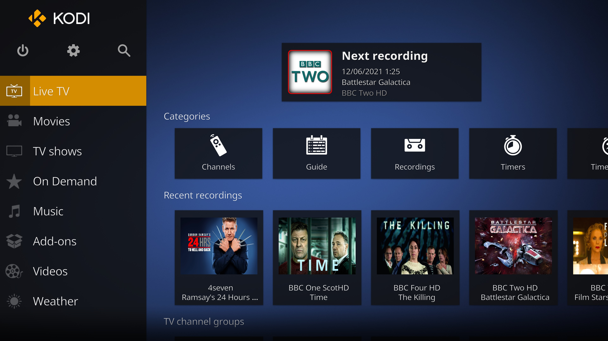
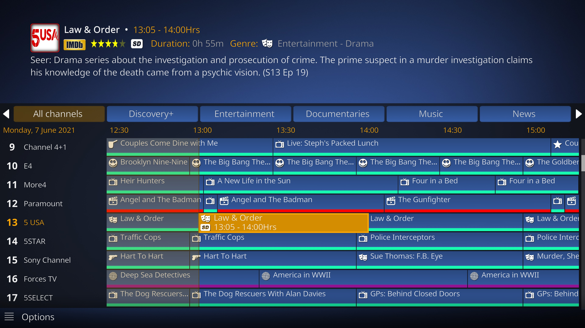
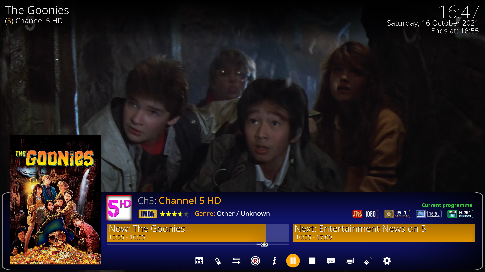
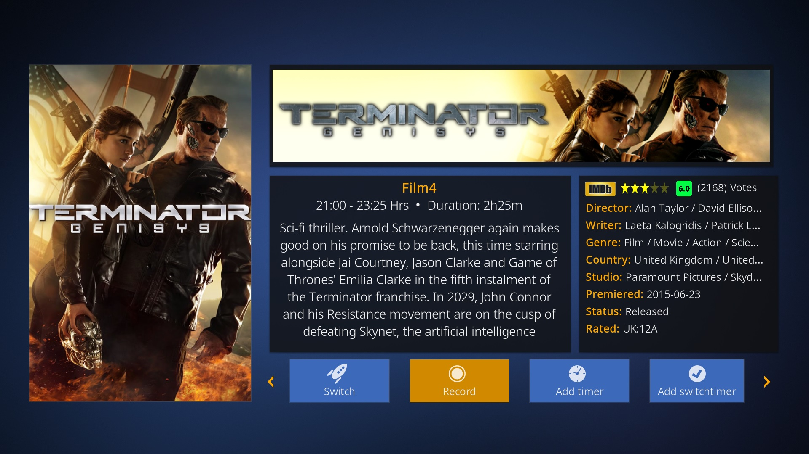
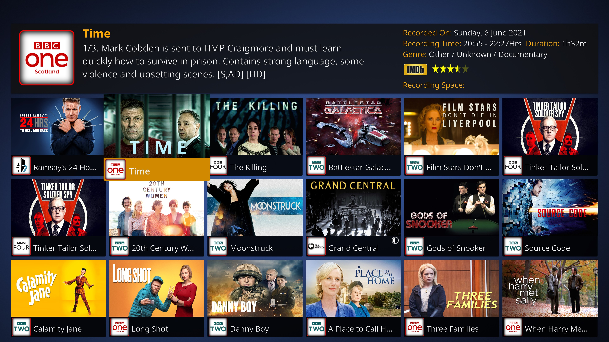
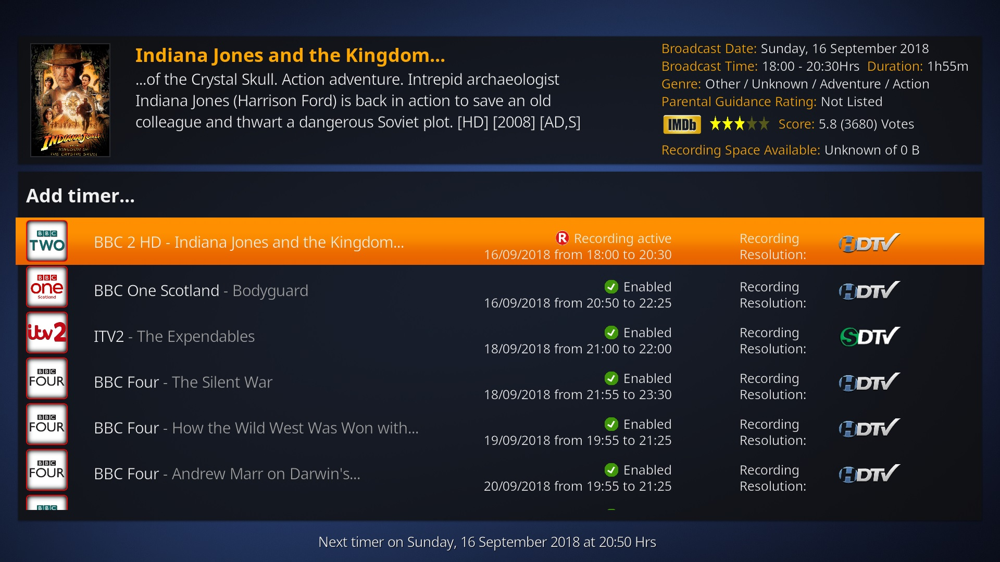

# Skin.Estuary.PVR.plus

EstuaryPVR+ is a modification of the default Estuary skin, originally written by Phil65 and now maintained by Team Kodi.
The skin aims to offer users some additional PVR features that are not currently available on the default version of Estuary and to have a more detailed OSD, whilst remaining a very light weight and easy-to-use skin.
 
### Dependencies

Estuary.PVR+ does not require any additional dependencies to work. However, some addiotnal PVR features will only work when the Skin.Helper.Script is installed. This addon can be downloaded from here [https://github.com/kodi-community-addons/script.skin.helper.service]

# License

This work has been released under GNU General Public License (GPL), Version 2.0

# New Features Added

(Global)
- Colourised OSD and media flags throughout.
- New smaller posters displayed on Home Screen for movies and TV Shows.
- New OSD layouts and buttons added throughout skin, including new info OSD dialogs .
- 3 new colour themes added to skin (Black, Cobalt (blue), Claret (red)
- 3 new skin views added (Flix Large, Flix Wide and Flix Landscape)

(Live Tv)
- New PVR settings added to skin settings with additional Live TV options.
- Artwork supported on all PVR screens (Can be used individually or combination of Backend, Local and Skin Helper)
- Now/Next programmes displayed on new Live TV OSD layout.
- New 'Last Channel Played' button added to Live TV OSD that switches back to last live tv channel played.
- New TV Channel Screen layouts including Now/Next view. ('Next' artwork only works when local artwork is enabled, otherwise default fallback image is displayed)
- New Layouts for TV Recording and Timer Screens.
- New Layout for OSD Channel Guide.
- New PVR Info Dialog in line with the look of the Video and Music Info Dialogs.
- PVR Recording artwork displayed on Home Menu (Only works when local artwork is enabled, otherwise default fallback image is displayed.)
- Banner Artwork dialog for 'Next/Up' TV Programme appearing 30 seconds before next programme start (Enabled via new PVR Settings in the skin settings or via PVR Sideblade on the EPG screen. This feature only works when local artwork is enabled, otherwise default fallback image is displayed).
- Ability to disable TV Groups from EPG (Via new PVR Settings in the skin settings or via PVR Sideblade on the EPG screen).
- Ability to disable Live TV Genre Colours (Via new PVR settings in the skin setings or via PVR Sideblade on the EPG screen).
- Ability to display actual premiered flags on EPG instead of a '*' as the indicator (Via new PVR settings in the skin setings).
- Movie clapperboard icon added to genre on EPG Screen if genre contains 'Movie or Film'
- New 'Day' indicator added to plot panel on OSD Guide.

(Movies)
- New OSD Layout for Movies.
- New Actor button added to Movie OSD which opens new OSD dialog showing actors for movie being played.
- Ability to add movies to 'Watchlist' via button on 'Flix Large' view or via context menu on any other skin view. (Needs Metedata Editor installed)
- New 'Watchlist' and '4K Movies' added to catagories on Movie Home Menu.
- New 'Watchlist' and '4K Movie' widgets added to Movie Home Menu.
- New 'Decades' widget added to Movie Home Menu which allow you display movies in library by decade.
- New content flags added to OSD and Flix views to display if movie is 'Kodi Local library', 'Netflix', 'Prime', 'iplayer' or 'YouTube'.
- Ability to display clearart above the OSD via the OSD settings or using Skin Settings.

(TV Shows)
- New OSD Layout for TV Shows.
- New Actor button added to TV Show OSD which opens new OSD dialog showing actors for TV show being played.
- Ability to display clearart above the OSD via the OSD settings or using Skin Settings.

(Music)
- New OSD Layout for Music.
- Animated graphic equilizer added to Music OSD when music is playing.
- New Artist Biography button added to Music OSD which opens Music Artist OSD dialog.
- Next 3 tracks coming up shown on the bottom left hand side of  music OSD.
- Support for Fake Disc Art added if no original album disc art exists. If clearlogo is avilable, this will be added to fake disc, other text will be used.
- Ability to enable Disc Art via Music OSD settings.
- Ability to enable Artist Clearlogo via Music OSD Settings.
- Ability to enable scrolling text via Music OSD Settings.
- Ability to switch from colorised equalizer on Music OSD to plain white colour using OSD settings.
- New Recommended Songs Widget added to Music Home Menu.

(Music Videos)
- New OSD Layout for Music Videos.
- New Playlist button added to OSD so users can now view queued Music Video's.

# PVR Artwork

Traditionally, PVR artwork is normally provided by a PVR backend server or guide data that is capable of passing artwork images to Kodi. This is normally achieved by storing artwork images on the server side or individual guide data entries pointing to a URL that provides the artwork image.

However, based on my own personal experiences of using artwork provided by a PVR backend can often lead to incorrectly matched artwork for programme items. Often, I've found it not easy to fix artwork mis-matches. 
Also, users are normally limited to one artwork type only, eg (Poster or Fanart) when using a backend server that is capable of providing artwork images.

EstuaryPVR+ attempts to improve upon the existing PVR Artwork methods by allowing users to now define how they actually wish to fetch PVR artwork via a new 'PVR settings' option which can be found under the 'Skin Settings'.
There are 3 Artwork options available, which can be used individually or in combination with each other:-
1) Back-End Artwork
2) Skin Helper Script Artwork
3) Local Artwork 

### PVR Artwork Settings

Backend Artwork

Users can set these new PVR artwork settings individually or use them together.

# Screenshots

### Live TV Home Menu with Recording thumbnail artwork

### New EPG Layout with 'New' and 'Premier' flags

### New PVR OSD Layout with 'Now-Next' Programmes

### New PVR Channels 'PVR+ Big List' View

### New PVR Info Dialog View

### New PVR Channels 'PVR+ Now-Next' View

# New Live TV Recordings Layout

